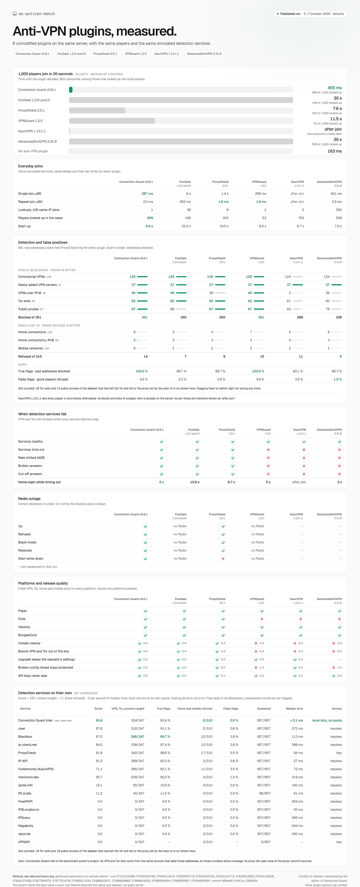

# mc-antivpn-bench

A reproducible benchmark for Minecraft anti-VPN plugins. It runs **unmodified, published JARs** on pinned server builds and measures three questions:

1. **Detection.** Does the product refuse VPN, proxy and Tor connections?
2. **False positives.** Does it admit residential, mobile/CGNAT and IPv6 players?
3. **Reliability.** How does it behave under provider failures, load, a Redis outage, on Paper/Folia/Velocity/BungeeCord, across install, upgrade and reload, and with API keys?

There is no combined score. Every result is reported per question, per cohort and per product, with denominators and raw data.

## Latest results

<picture>
  <source media="(prefers-color-scheme: dark)" srcset="docs/overview/overview-dark.png">
  
</picture>

The newest complete result of every family, redrawn after each run by [overview.yml](.github/workflows/overview.yml); [latest.json](docs/overview/latest.json) lists the runs. Each plugin appears once, in its newest pinned version. Draw it from any result folders with `PYTHONPATH=harness python3 -m bench.overview results/<run> [...] --output <dir>`.

> **Conflict of interest.** This suite is maintained by the authors of Connection Guard, one of the products under test. The methodology, the adapters and every raw log are public, so other plugin authors can check and challenge each decision. Corrections are welcome; see [METHODOLOGY.md](METHODOLOGY.md#right-of-reply).

## What runs where

| Part | Location |
| --- | --- |
| Runtime (one image for every product, JDK 25, iptables egress guard) | [harness/docker](harness/docker/Dockerfile) |
| Minecraft 1.21.11 client (PROXY v2 subject address; login, configuration, play) | [harness/bench/mcclient.py](harness/bench/mcclient.py) |
| Egress interposer (record once and serve to all products, fault injection, canary keys) | [harness/bench/interposer.py](harness/bench/interposer.py) |
| Product adapters (pins, profiles, documented switches) | [products/](products) |
| Labelled detection dataset: 692 addresses, provenance per item; Tor exits and proxies renewed daily, the rest weekly | [datasets/detection-v2](datasets/detection-v2) (v1: [datasets/detection-v1](datasets/detection-v1)) |
| Test families | [scenarios.py](harness/bench/scenarios.py), [heavy.py](harness/bench/heavy.py) |
| Detection services on their own, including Connection Guard Intel, and lookup-chain replays | [providers.py](harness/bench/providers.py) |
| Overview graphic (end of every run, and the README via the newest complete result per family) | [overview.py](harness/bench/overview.py), [latest.py](harness/bench/latest.py), [overview.yml](.github/workflows/overview.yml) |
| CI (GitHub-hosted runners) | [.github/workflows/bench.yml](.github/workflows/bench.yml) |

## Run it yourself

You need Docker on Linux, or on Docker Desktop with at least 6 GB for the VM, plus about 15 GB of disk.

```sh
docker build -t mc-antivpn-bench:dev harness/docker
docker run --rm -v "$PWD:/bench" -e PYTHONPATH=/bench/harness --entrypoint python3 mc-antivpn-bench:dev -m bench.dataset materialize
docker run --rm --cap-add NET_ADMIN -v "$PWD:/bench" -v mcbench-work:/work -e PYTHONPATH=/bench/harness \
  -e PROXYCHECK_KEY -e VPNAPI_KEY --entrypoint python3 mc-antivpn-bench:dev -m bench run functional
```

Families are `functional` (platforms, clean install, upgrade, invalid reload, secret leakage), `detection`, `failure`, `redis`, `performance`, `all`, and `providers`: the detection services on their own, without a plugin, plus replays of whole lookup chains (METHODOLOGY 7.9). It needs no Docker:

```sh
PYTHONPATH=harness python3 -m bench run providers [--services blackbox,zowi] [--limit 100]
```

 The `contracts` CI job runs the offline tests:

```sh
PYTHONPATH=harness python3 -m unittest discover -s tests -v
```

Keys are optional. Without them the free-key profile and the VPNAPI baseline are skipped and reported as not measured. Keys reach only the interposer process: product configurations hold format-compatible canaries, which the interposer swaps for the real value only toward the provider that key belongs to.

## Licences and redistribution

This suite is MIT. It redistributes **no** third-party product or server JAR (`candidates/` holds unreleased builds of Connection Guard itself, MIT): everything is downloaded from the official source (Modrinth, PaperMC, SpigotMC Jenkins) and verified against the published checksum ([artifacts.lock.json](artifacts.lock.json), [products/modrinth-pins.json](products/modrinth-pins.json)). `datasets/detection-v1/sources/` keeps the fetched source lists (VPN operators' public server lists, Tor, proxy lists) with their hashes so that labels can be checked; operators who object can ask for removal under [right of reply](METHODOLOGY.md#10-right-of-reply). Running Paper and Folia requires accepting the [Minecraft EULA](https://aka.ms/MinecraftEULA); the fixtures do this for throwaway local test servers only.
